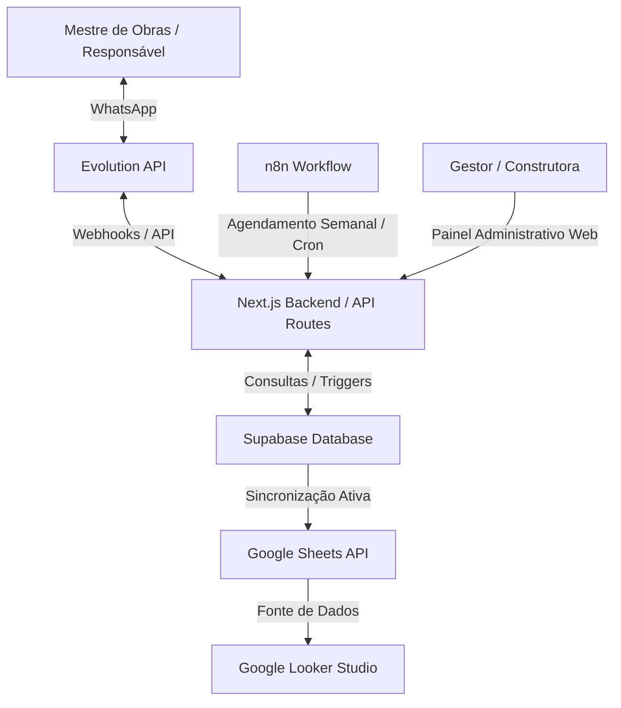
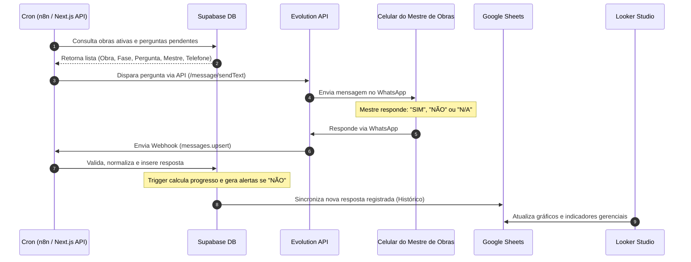

# Estrutura Completa do Projeto: Sistema de Acompanhamento de Obras via WhatsApp

Este documento apresenta a arquitetura, o fluxo operacional, as definições tecnológicas e os planos de implementação para o sistema de acompanhamento de obras multi-tenant, otimizado para baixo custo e alta eficiência.

---

## 1. Arquitetura Completa do Sistema

A arquitetura foi projetada com foco em custo zero (free tiers), alto desempenho e baixo consumo de processamento/tokens.



### Componentes de Infraestrutura:
1. **Frontend/Backend (SaaS Web)**: Next.js (React) hospedado na **Vercel** (Plano Free).
2. **Banco de Dados & Autenticação**: **Supabase** (PostgreSQL com Row Level Security - RLS) no plano gratuito.
3. **Gateway WhatsApp**: **Evolution API** (Open-source, gratuita) rodando em uma VPS própria (ex: Hetzner/DigitalOcean) ou hospedada em serviços como **Railway** (dentro do plano gratuito de desenvolvimento ou com custos mínimos sob demanda).
4. **Automação & Orquestração**: **n8n** (Auto-hospedado ou via Next.js Cron integrado) para envio ativo semanal e sincronização com Google Sheets.
5. **Dashboard Gerencial**: **Google Sheets** (como Data Warehouse/Lake intermediário) + **Google Looker Studio** (Visualização corporativa e relatórios interativos), oferecendo custo operacional zero.

---

## 2. Fluxo Operacional

O ciclo de vida do acompanhamento semanal funciona de maneira síncrona e reativa:



---

## 3. Tecnologias Ideais

| Tecnologia | Função no Sistema | Modelo de Custo | Justificativa |
| :--- | :--- | :--- | :--- |
| **Next.js 15 (App Router)** | Painel Web, API de Webhook e Gestão de Cadastros | Gratuito (Vercel) | Alta velocidade, SSR/ISR, API routes integradas e responsividade nativa. |
| **Supabase (PostgreSQL)** | Banco relacional, autenticação, segurança RLS e triggers de progresso | Gratuito (Free Tier) | Dispensa backend complexo, possui RLS nativo e triggers eficientes em PL/pgSQL. |
| **Evolution API** | Integração direta com WhatsApp (Baileys) | Gratuito (Open-Source) | Sem custos por mensagem, multi-instância (multi-tenant), leve e estável. |
| **n8n (Self-hosted)** | Cron scheduler, automações e integrações secundárias | Gratuito (Open-Source) | Alternativa visual e robusta ao Make/Zapier, permitindo rodar em containers leves. |
| **Google Sheets API** | Banco de dados analítico e sincronização do histórico | Gratuito | Armazenamento de histórico ilimitado para BI sem custos adicionais. |
| **Google Looker Studio** | Dashboards gerenciais, gráficos interativos e relatórios | Gratuito | Ferramenta líder de BI gratuita, conectada diretamente ao Google Sheets. |

---

## 4. Estrutura do Banco Supabase

A estrutura foi modelada no padrão **Multi-tenant** utilizando políticas de RLS.

### Tabelas Principais (Esquema Físico)

```sql
-- 1. Tenants (Empresas/Construtoras)
CREATE TABLE public.tenants (
  id uuid PRIMARY KEY DEFAULT gen_random_uuid(),
  name text NOT NULL,
  created_at timestamp with time zone DEFAULT now()
);

-- 2. Usuários (Extensão do auth.users do Supabase)
CREATE TABLE public.usuarios (
  id uuid PRIMARY KEY REFERENCES auth.users(id) ON DELETE CASCADE,
  nome text NOT NULL,
  email text UNIQUE NOT NULL,
  telefone text,
  funcao text DEFAULT 'usuario', -- 'admin', 'mestre_obras', 'usuario'
  tenant_id uuid REFERENCES public.tenants(id) ON DELETE SET NULL,
  created_at timestamp with time zone DEFAULT now()
);

-- 3. Obras
CREATE TABLE public.obras (
  id uuid PRIMARY KEY DEFAULT gen_random_uuid(),
  nome text NOT NULL,
  descricao text,
  cliente text,
  mestre_obras_id uuid REFERENCES public.usuarios(id) ON DELETE SET NULL,
  status text DEFAULT 'ativa', -- 'ativa', 'concluida', 'pausada'
  progresso_total numeric DEFAULT 0.0 CHECK (progresso_total >= 0 AND progresso_total <= 100),
  data_inicio date,
  data_entrega_prevista date,
  orcamento_total numeric,
  manager_name text,
  manager_phone text,
  custom_greeting text,
  tenant_id uuid REFERENCES public.tenants(id) ON DELETE CASCADE,
  created_at timestamp with time zone DEFAULT now()
);

-- 4. Fases da Obra (Máximo de 20 por obra)
CREATE TABLE public.fases (
  id uuid PRIMARY KEY DEFAULT gen_random_uuid(),
  obra_id uuid NOT NULL REFERENCES public.obras(id) ON DELETE CASCADE,
  nome text NOT NULL,
  ordem integer NOT NULL CHECK (ordem >= 1 AND ordem <= 20),
  status text DEFAULT 'pendente', -- 'pendente', 'em_andamento', 'concluida'
  progresso numeric DEFAULT 0.0 CHECK (progresso >= 0 AND progresso <= 100),
  created_at timestamp with time zone DEFAULT now(),
  UNIQUE(obra_id, ordem)
);

-- 5. Perguntas da Fase (2 a 4 por fase, tipo SIM/NÃO)
CREATE TABLE public.perguntas (
  id uuid PRIMARY KEY DEFAULT gen_random_uuid(),
  fase_id uuid NOT NULL REFERENCES public.fases(id) ON DELETE CASCADE,
  texto_pergunta text NOT NULL,
  ordem integer NOT NULL CHECK (ordem >= 1 AND ordem <= 4),
  created_at timestamp with time zone DEFAULT now(),
  UNIQUE(fase_id, ordem)
);

-- 6. Respostas (SIM / NÃO / N/A)
CREATE TABLE public.respostas (
  id uuid PRIMARY KEY DEFAULT gen_random_uuid(),
  obra_id uuid NOT NULL REFERENCES public.obras(id) ON DELETE CASCADE,
  fase_id uuid NOT NULL REFERENCES public.fases(id) ON DELETE CASCADE,
  pergunta_id uuid NOT NULL REFERENCES public.perguntas(id) ON DELETE CASCADE,
  resposta text NOT NULL CHECK (resposta IN ('SIM', 'NÃO', 'N/A')),
  observacao text,
  usuario_responsavel uuid REFERENCES public.usuarios(id) ON DELETE SET NULL,
  data_resposta timestamp with time zone DEFAULT now()
);
```

### Triggers de Automação de Progresso e Normalização

* **Trigger `trg_normaliza_resposta`**: Garante que respostas enviadas como "nao", "na", "sim" sejam tratadas e salvas rigorosamente como `'NÃO'`, `'N/A'` ou `'SIM'`.
* **Trigger `trg_atualiza_progresso`**: Executado após qualquer nova resposta. Calcula o percentual de conclusão da fase através da fórmula:
  
  $$\text{Progresso Fase} = \frac{\text{Quantidade de respostas 'SIM'} \times 100}{\text{Total de perguntas da fase} - \text{Respostas 'N/A'}}$$

  E, em seguida, atualiza o progresso da obra com a média aritmética das fases.

---

## 5. Integração WhatsApp

A integração utiliza a **Evolution API**, operando em modo multi-empresa (uma instância WhatsApp vinculada a cada tenant ou uma única instância centralizadora controlando os roteamentos).

* **Geração de Conexão**: O gestor do SaaS gera o QR Code no dashboard web através da chamada `GET /instance/connect/{instance_name}` e realiza o pareamento de forma nativa.
* **Consumo Otimizado**: Para reduzir a quantidade de tokens consumida por mensagens desnecessárias, a Evolution API é configurada para ouvir estritamente o evento `messages.upsert` de conversas privadas, ignorando grupos, status e mídias.

---

## 6. Automação de Envio Semanal

O fluxo semanal é programado para disparar às sextas-feiras às 16h:

1. O **Cron** realiza uma chamada segura para a rota `/api/cron/perguntas` do Next.js (protegida com token `CRON_SECRET`).
2. A API busca no Supabase quais obras estão ativas, qual a fase atual de cada uma e qual a primeira pergunta que ainda não possui resposta registrada.
3. Se a pergunta for a primeira da fase, a mensagem é introduzida com a saudação personalizada (`custom_greeting`) definida pela construtora.
4. O gateway da Evolution API realiza o disparo assíncrono respeitando intervalos de 1,2 segundos para evitar banimento do número (Anti-Ban).

---

## 7. Estrutura dos Dashboards (Google Sheets + Looker Studio)

Para obter um dashboard corporativo e gerencial avançado com **custo zero**, estruturamos a integração com as plataformas Google.

### 7.1. Sincronização automática para Google Sheets
Toda vez que uma resposta é inserida ou modificada no Supabase, a linha correspondente é inserida em uma planilha do Google Sheets através de um webhook ou fluxo no n8n.
A planilha do Google Sheets possui a seguinte estrutura de colunas:

| Coluna | Descrição | Tipo de Dado |
| :--- | :--- | :--- |
| `ID Resposta` | Identificador único da resposta | UUID |
| `Data Resposta` | Data e hora em que a resposta foi registrada | Timestamp |
| `Construtora / Tenant` | Nome do Tenant associado | Texto |
| `Obra` | Nome da Obra | Texto |
| `Fase` | Nome da Etapa/Fase da obra | Texto |
| `Pergunta` | Texto da pergunta respondida | Texto |
| `Resposta` | SIM / NÃO / N/A | Texto |
| `Responsável` | Nome de quem respondeu (Mestre/Gerente) | Texto |
| `Progresso Fase (%)` | Progresso atualizado da fase correspondente | Percentual |
| `Progresso Obra (%)` | Progresso atualizado total da obra | Percentual |

### 7.2. Visualização no Google Looker Studio
Com a planilha do Google Sheets conectada como fonte de dados no Looker Studio, criamos três relatórios gerenciais principais:

1. **Dashboard de Evolução das Obras**:
   - Gráfico de linha mostrando a evolução do progresso total de cada obra ao longo do tempo.
   - Visão geral de progresso médio consolidado por construtora.
2. **Painel de Pendências e Alertas (Mapa de Calor)**:
   - Tabela dinâmica exibindo onde houve respostas `'NÃO'` (que geram alertas automáticos de risco de atraso).
   - Indicadores visuais em vermelho para alertar os gestores sobre etapas travadas.
3. **Histórico Consolidado**:
   - Filtros dinâmicos por Obra, Fase, Responsável e Período de tempo para auditoria rápida e exportação de PDF para reuniões de diretoria.

---

## 8. Fluxo de Autenticação

A segurança e isolamento de acessos no painel administrativo web são garantidos pelo **Supabase Auth**:

1. **Cadastro/Login**: Usuários realizam login com e-mail e senha.
2. **Atribuição de Tenant**: O token JWT gerado pelo Supabase inclui as informações de perfil do usuário. O banco de dados valida se o `tenant_id` do usuário confere com os recursos consultados.
3. **Middleware do Next.js**: Protege as rotas `/dashboard`, `/obras`, `/fases`, `/alertas` e `/historico`. Se o usuário não possuir uma sessão ativa, é redirecionado para `/login`.

---

## 9. Escalabilidade

O sistema foi desenhado para escalar sem exigir aumento proporcional de custos:

* **Processamento Serverless**: Next.js na Vercel escala automaticamente de acordo com as requisições de webhooks e acessos ao painel.
* **Otimização do Banco**: Triggers no banco de dados evitam processamento redundante no servidor Next.js. Índices nas colunas de busca comum (`mestre_obras_id`, `obra_id`, `fase_id`, `tenant_id`) garantem respostas rápidas mesmo com milhões de linhas.
* **Arquitetura de Filas**: A Evolution API armazena as mensagens em um cache Redis local para garantir que picos de envio na sexta-feira às 16h não causem gargalos ou perda de pacotes.

---

## 10. Segurança dos Dados

Garantia de conformidade (LGPD) e isolamento empresarial completo:

* **Row Level Security (RLS)**: Habilitado em todas as tabelas do Supabase. Um usuário de uma construtora jamais consegue ver dados de outra construtora, pois todas as consultas SQL filtram implicitamente pelo `tenant_id` atrelado à sessão do usuário.
* **Comunicação Criptografada**: Todos os endpoints da API, webhooks e comunicações com o Supabase utilizam criptografia SSL/HTTPS.
* **Segurança de Webhooks**: O webhook que recebe mensagens do WhatsApp valida se os dados vieram de uma instância autorizada e mapeia os remetentes estritamente pelos telefones cadastrados e ativos no banco.

---

Este projeto está estruturado, versionado via GitHub e pronto para produção, combinando eficiência operacional, alta confiabilidade e custo de manutenção extremamente baixo.
